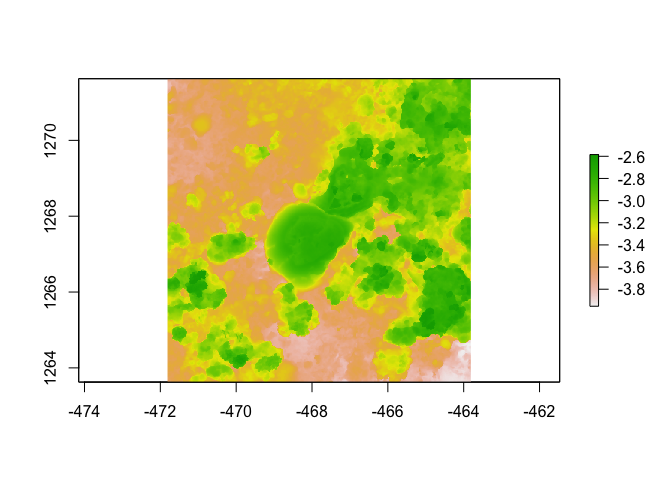

Assignment
================
Maluhia Stark-Kinimaka
(August 21, 2023)

``` r
  library(raster)
```

    ## Loading required package: sp

    ## The legacy packages maptools, rgdal, and rgeos, underpinning the sp package,
    ## which was just loaded, will retire in October 2023.
    ## Please refer to R-spatial evolution reports for details, especially
    ## https://r-spatial.org/r/2023/05/15/evolution4.html.
    ## It may be desirable to make the sf package available;
    ## package maintainers should consider adding sf to Suggests:.
    ## The sp package is now running under evolution status 2
    ##      (status 2 uses the sf package in place of rgdal)

``` r
  library(habtools)
```

    ## 
    ## Attaching package: 'habtools'

    ## The following object is masked from 'package:raster':
    ## 
    ##     extent

``` r
  library(ggplot2)
  library(dplyr)
```

    ## 
    ## Attaching package: 'dplyr'

    ## The following objects are masked from 'package:raster':
    ## 
    ##     intersect, select, union

    ## The following objects are masked from 'package:stats':
    ## 
    ##     filter, lag

    ## The following objects are masked from 'package:base':
    ## 
    ##     intersect, setdiff, setequal, union

``` r
  library(fishualize)

  plot(horseshoe)
```

    ## Warning in sp::CRS(...): sf required for evolution_status==2L

    ## Warning in sp::CRS(...): sf required for evolution_status==2L

<!-- -->

### Current Lab

Geometric Ecology Lab

### Project Focus

Still developing, but along the lines of understanding how coral
morphology relates to wave energy attenuation. Maybe conceptualizing how
to derive coral “roughness” values by species for storm event modeling.

### Why This Course?

Quantifying how the ocean moves through and around coral reef is the
coolest thing ever.

### Course Learning Goals

1)  Learn current methodologies for measuring coral geometry.
2)  Become very comfortable creating reproductions of reef structure (3D
    printing, SfM model creation).
3)  Understand more deeply how geometry effects reef accretion and wave
    energy attenuation using observation, R, and reproduction model
    analysis.
4)  Have fun.

### Experience with R

This assignment, also simultaneously taking MBIO 612 (Data Science &
Fundamentals in R).

### Fun Fact

My first name is 28 letters long.
